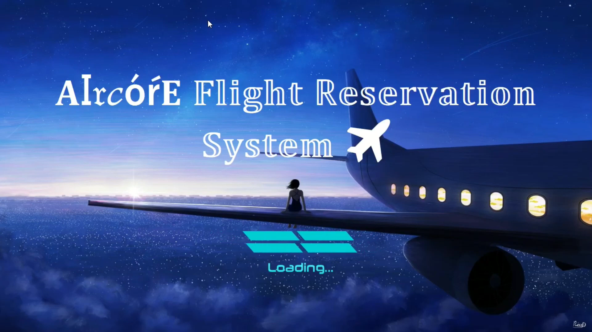
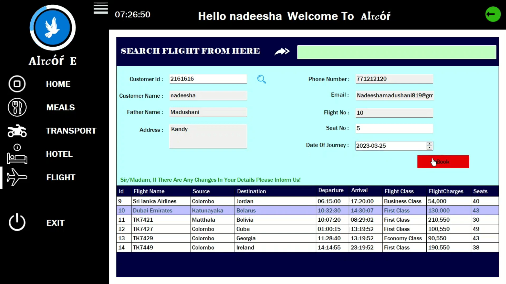
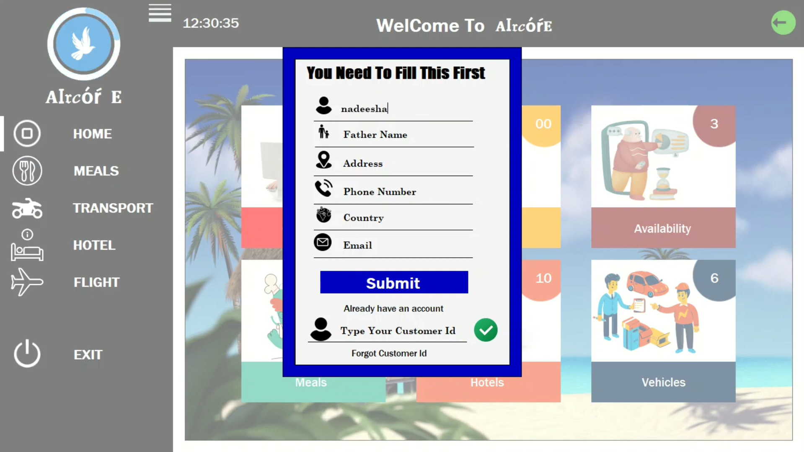

# 🎫 Ticket Management System

[](https://dotnet.microsoft.com/)
[](https://mysql.com/)
[](LICENSE)
[]()

A comprehensive desktop application for managing airline tickets, hotel bookings, and transport services. Built with C# Windows Forms and MySQL database.

## 📋 Table of Contents

- [Overview](#overview)
- [Features](#features)
- [Screenshots](#screenshots)
- [Architecture](#architecture)
- [Installation](#installation)
- [Database Setup](#database-setup)
- [Usage](#usage)
- [API Reference](#api-reference)
- [Contributing](#contributing)
- [License](#license)
- [Contact](#contact)

## 🌟 Overview

The Ticket Management System is designed for **Aircore Ticketing Services** to automate and streamline their business operations. The system eliminates manual processes and provides a user-friendly interface for managing customers, flights, hotels, transport, and employees.

### 🎯 Project Goals
- Reduce manual work and human errors
- Improve data security and consistency
- Provide efficient booking and management system
- Generate comprehensive business reports
- Automate salary and payment processing

## ✨ Features

### 👨‍💼 Admin Features
- **Dashboard**: Comprehensive overview of all operations
- **Customer Management**: Add, edit, delete, and view customer records
- **Flight Management**: Manage flight schedules, pricing, and bookings
- **Hotel Management**: Handle hotel bookings and room availability
- **Transport Management**: Manage vehicle rentals and bookings
- **Employee Management**: Staff records and role management
- **Salary Processing**: Automated salary calculations and payments
- **Report Generation**: Various business reports and analytics
- **Email Notifications**: Automated booking confirmations

### 👤 Guest Features
- **Customer Registration**: Self-registration with email verification
- **Flight Booking**: Browse and book available flights
- **Hotel Booking**: Reserve hotel rooms
- **Transport Booking**: Rent vehicles
- **Booking History**: View past and current bookings

## 📷 Screenshots

### Main Dashboard


### Flight Booking Interface


### Customer Management


*More screenshots available in the `/screenshots` directory*

## 🏗️ Architecture

### System Architecture
- **Frontend**: Windows Forms Application (C#/.NET)
- **Backend**: Business Logic Layer (C#)
- **Database**: MySQL Server
- **Pattern**: 3-Tier Architecture (Presentation → Business Logic → Data Access)

### Technology Stack
- **IDE**: Visual Studio 2015/2019/2022
- **Framework**: .NET Framework 4.8
- **Database**: MySQL 8.0+
- **ORM**: ADO.NET
- **UI**: Windows Forms
- **Reports**: Crystal Reports / Custom Report Generator

## 🚀 Installation

### Prerequisites
- Visual Studio 2015 or later
- .NET Framework 4.8 or later
- MySQL Server 8.0 or later
- MySQL Workbench (optional, for database management)

### Step 1: Clone the Repository
```bash
git clone https://github.com/yourusername/ticket-management-system.git
cd ticket-management-system
```

### Step 2: Database Setup
1. Create a MySQL database named `ticket_management_db`
2. Run the SQL scripts in the `/Database` folder:
```bash
mysql -u root -p ticket_management_db < Database/create_tables.sql
mysql -u root -p ticket_management_db < Database/sample_data.sql
```

### Step 3: Configure Connection String
Update the connection string in `App.config`:
```xml
<connectionStrings>
  <add name="DefaultConnection" 
       connectionString="Server=localhost;Database=ticket_management_db;Uid=root;Pwd=yourpassword;" 
       providerName="MySql.Data.MySqlClient" />
</connectionStrings>
```

### Step 4: Build and Run
1. Open `TicketManagementSystem.sln` in Visual Studio
2. Restore NuGet packages
3. Build the solution (Ctrl + Shift + B)
4. Run the application (F5)

## 🗄️ Database Setup

### Required Tables
The system uses the following main tables:
- `Customer` - Customer information
- `Flight` - Flight details and schedules
- `Hotel` - Hotel information
- `Transport` - Vehicle rental details
- `Employee` - Staff records
- `Booking` - Flight bookings
- `Payment` - Payment and salary records
- `Accounts` - User authentication

### Sample Database Creation
```sql
-- Create database
CREATE DATABASE ticket_management_db;
USE ticket_management_db;

-- Create Customer table
CREATE TABLE Customer (
    Id INT AUTO_INCREMENT PRIMARY KEY,
    Name NVARCHAR(50) NOT NULL,
    Address NVARCHAR(50),
    PhoneNo NVARCHAR(50),
    Email NVARCHAR(50),
    Country NCHAR(10),
    FatherN NVARCHAR(50)
);

-- Additional tables in Database/create_tables.sql
```

## 📖 Usage

### Default Login Credentials
- **Admin**: Username: `admin`, Password: `admin123`
- **Guest**: Registration required through the application

### Basic Workflow
1. **Start Application**: Launch the exe file or run from Visual Studio
2. **Login**: Use admin credentials or register as guest
3. **Navigate**: Use the dashboard to access different modules
4. **Manage Data**: Add, edit, or delete records as needed
5. **Generate Reports**: Access reports from the admin panel

### Key Operations

#### Customer Registration
```csharp
// Example usage in code
CustomerManager customerMgr = new CustomerManager();
Customer newCustomer = new Customer()
{
    Name = "John Doe",
    Email = "john@example.com",
    PhoneNo = "1234567890"
};
customerMgr.AddCustomer(newCustomer);
```

#### Flight Booking
```csharp
// Example flight booking
FlightManager flightMgr = new FlightManager();
Booking booking = new Booking()
{
    CustomerId = 1,
    FlightId = 101,
    DateOfJourney = DateTime.Now.AddDays(7),
    SeatNo = 12
};
flightMgr.BookFlight(booking);
```

## 📁 Project Structure

```
TicketManagementSystem/
├── 📁 Database/
│   ├── create_tables.sql
│   ├── sample_data.sql
│   └── stored_procedures.sql
├── 📁 TicketManagementSystem/
│   ├── 📁 Forms/
│   │   ├── AdminForms/
│   │   ├── GuestForms/
│   │   └── CommonForms/
│   ├── 📁 BusinessLogic/
│   │   ├── CustomerManager.cs
│   │   ├── FlightManager.cs
│   │   ├── HotelManager.cs
│   │   └── EmployeeManager.cs
│   ├── 📁 DataAccess/
│   │   ├── DatabaseHelper.cs
│   │   ├── CustomerDAL.cs
│   │   └── FlightDAL.cs
│   ├── 📁 Models/
│   │   ├── Customer.cs
│   │   ├── Flight.cs
│   │   └── Booking.cs
│   └── 📁 Utilities/
│       ├── EmailService.cs
│       └── ReportGenerator.cs
├── 📁 Documentation/
│   ├── System_Design.md
│   ├── User_Manual.pdf
│   └── API_Documentation.md
├── 📁 Screenshots/
├── README.md
├── LICENSE
└── .gitignore
```

## 🔧 Configuration

### App.config Settings
```xml
<?xml version="1.0" encoding="utf-8"?>
<configuration>
  <connectionStrings>
    <add name="DefaultConnection" 
         connectionString="Server=localhost;Database=ticket_management_db;Uid=root;Pwd=password;" />
  </connectionStrings>
  
  <appSettings>
    <add key="EmailSMTP" value="smtp.gmail.com" />
    <add key="EmailPort" value="587" />
    <add key="EmailUsername" value="your-email@gmail.com" />
    <add key="EmailPassword" value="your-app-password" />
  </appSettings>
</configuration>
```

## 🤝 Contributing

We welcome contributions! Please follow these steps:

1. Fork the repository
2. Create a feature branch (`git checkout -b feature/AmazingFeature`)
3. Commit your changes (`git commit -m 'Add some AmazingFeature'`)
4. Push to the branch (`git push origin feature/AmazingFeature`)
5. Open a Pull Request

### Development Guidelines
- Follow C# coding conventions
- Write unit tests for new features
- Update documentation as needed
- Ensure database changes are backward compatible

## 📊 System Requirements

### Minimum Requirements
- **OS**: Windows 7 or later
- **RAM**: 2GB minimum, 4GB recommended
- **Storage**: 500MB available space
- **Database**: MySQL 5.7 or later

### Recommended Requirements
- **OS**: Windows 10/11
- **RAM**: 8GB or more
- **Storage**: 1GB available space
- **Database**: MySQL 8.0 or later

## 🐛 Known Issues

- Email service requires app-specific passwords for Gmail
- Report generation may be slow for large datasets
- Some UI elements may not scale properly on high-DPI displays

## 📝 Changelog

### Version 1.0.0 (2020-12-14)
- Initial release
- Basic customer and flight management
- Hotel and transport booking features
- Employee management system
- Report generation capabilities

## 📄 License

This project is licensed under the MIT License - see the [LICENSE](LICENSE) file for details.

## 👨‍💻 Contact

**Developer**: W.G.M.M. Ajmal  
**Institution**: National Institute of Co-operative Development, Polgolla  
**Course**: Diploma in Information Technology 2019/2020  
**ID**: DIT/FT/2019/14/363  

**Project Supervisor**: Mr. Dimuthu Kumara  
**Course Coordinator**: Mrs. I. Namali Nanayakara  

---

## 🙏 Acknowledgments

- National Institute of Co-operative Development
- Mr. Kumara Dimuthu (Guide)
- Mrs. I. Namali Nanayakara (Course Coordinator)
- Mr. Chanaka Dissanayake (Computer Instructor)

---

<div align="center">
  <p>⭐ If you found this project helpful, please give it a star!</p>
  <p>🚀 Built with passion for efficient ticket management</p>
</div>
